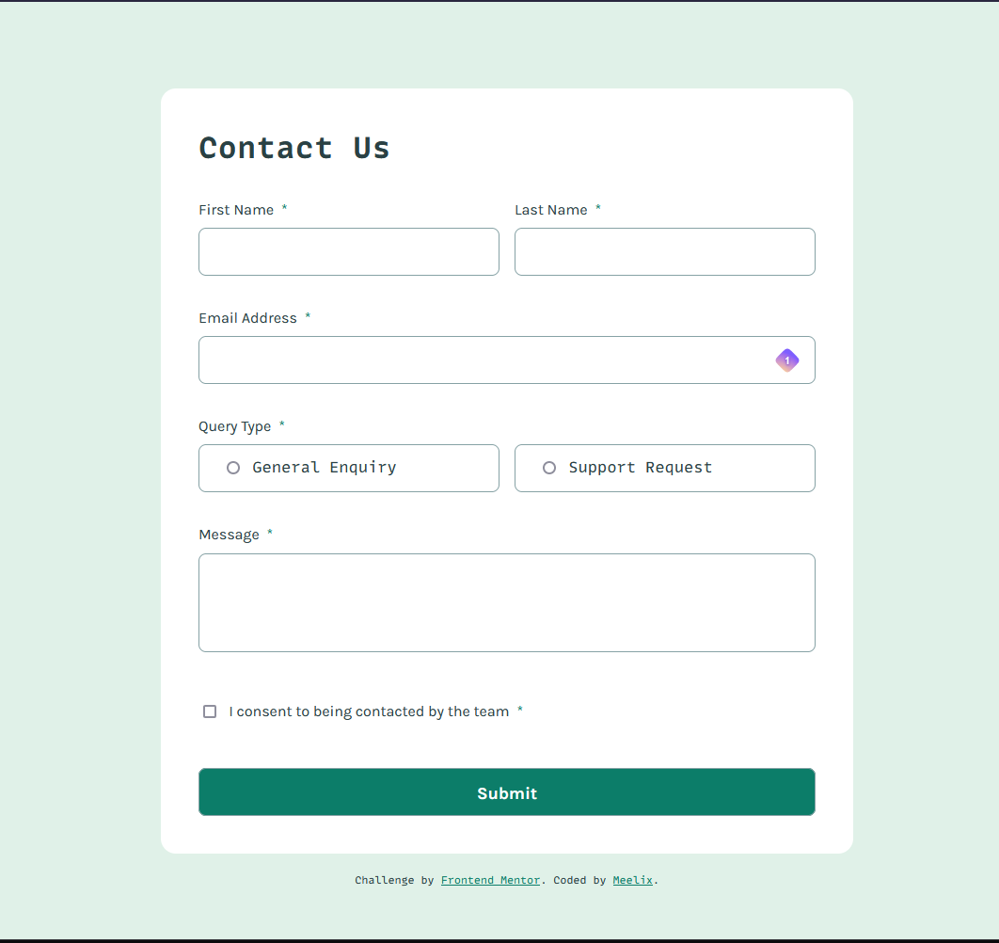

# Frontend Mentor - Contact form solution

This is a solution to the [Contact form challenge on Frontend Mentor](https://www.frontendmentor.io/challenges/contact-form--G-hYlqKJj). Frontend Mentor challenges help you improve your coding skills by building realistic projects. 

## The challenge

Users should be able to:

- [x] Complete the form and see a success toast message upon successful submission
- [x] Receive form validation messages if:
  - A required field has been missed
  - The email address is not formatted correctly
- [x] Complete the form only using their keyboard
- [x] Have inputs, error messages, and the success message announced on their screen reader
- [x] View the optimal layout for the interface depending on their device's screen size
- [x] See hover and focus states for all interactive elements on the page

## Screenshot

## Links

- [Solution URL](https://www.frontendmentor.io/solutions/contact-form-AEPigUHSVB)
- [Live Site URL](https://meelix.github.io/frontendmentor-contact-form/)

## Built with

- Native css nesting
- Css grid

## What I learned

native form validation
